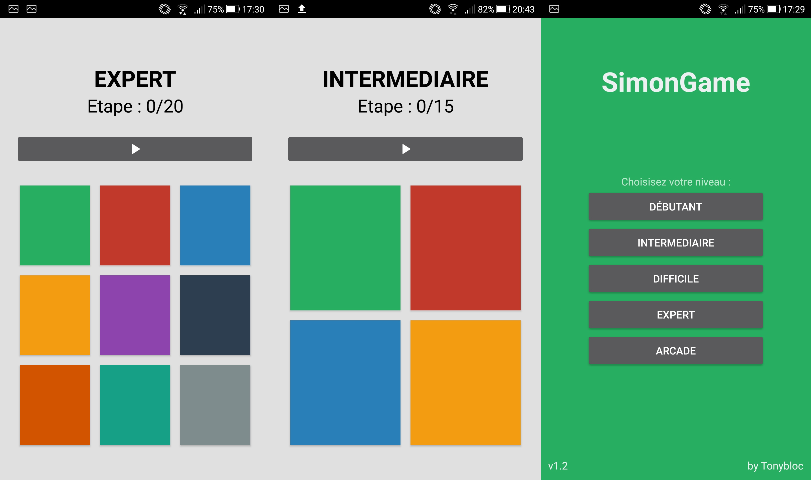

# Projet Simon

Création d'une application mobile reprenant le principe du jeu de société : "Simon"
Arriverez-vous à mémoriser toutes les combinaisons de couleurs ?

## Fonctionnalités : 
* Choix du mode de difficulté (débutant, intermédiaire, difficile, expert). Le nombre de cases et le nombre de répétition s'adaptent en fonction de la difficulté choisie
* Mode arcade : Atteignez votre meilleur score (Nombre de répétition illimité)

    
 
 